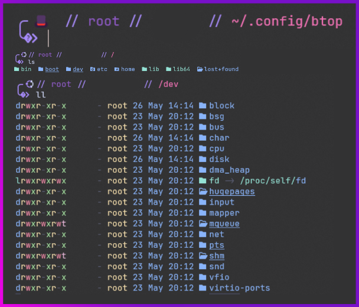
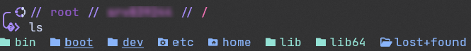

 <!-- top image -->

# 🌟 Nothing special or great, just uniform and clean (enough) for all my devices

Minimal, personal dotfiles for a clean and fast terminal setup. Currently includes:

- ⚡️ [Starship](https://starship.rs): A blazing-fast, customizable shell prompt
- 📁 [eza](https://github.com/eza-community/eza): A modern, maintained replacement for `ls` with colors and icons

## 📦 Requirements

Before using these configs, install:

- [Starship](https://starship.rs/install/)
- [eza](https://github.com/eza-community/eza)

## Preview

